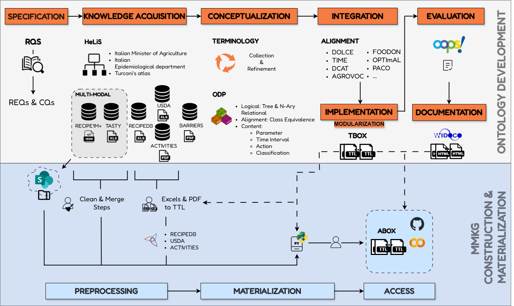
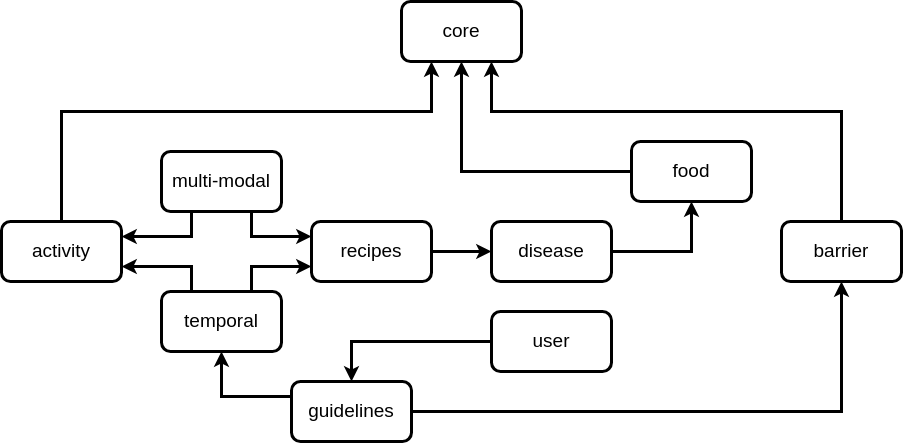

[![CC BY-SA 4.0][cc-by-sa-shield]][cc-by-sa] 

[cc-by-sa]: http://creativecommons.org/licenses/by-sa/4.0/
[cc-by-sa-shield]: https://img.shields.io/badge/License-CC%20BY--SA%204.0-lightgrey.svg

# FuS-KG: A Multi-Modal Knowledge Graph Supporting Personalized Health

Functional Status Information (FSI) describes physical and mental wellness
at the whole-person level. It includes information on activity performance, social
role participation, and environmental and personal factors affecting a person’s
well-being and quality of life. Collecting, integrating, and analyzing this multi-
modal information spanning different domains is crucial for addressing the needs
of an aging global population and providing effective care for individuals with
chronic conditions, multi-morbidity, and disabilities. Multi-Modal Knowledge
Graphs represent a suitable way for integrating this information in a complete and
structured way, allowing for reasoning and building tailored coaching solutions
that support individuals in their daily lives for healthy living. **FuS-KG** aims to play a central role concerning the design and development of
middle-layer applications of explainable behavior change systems allowing: (i) modeling
conceptual information representing individuals’ FSI and the use of the information to
adapt the generation of explanatory and motivational messages to the individual; (ii)
supporting interoperability among different systems which could share, for example,
databases of motivational messages or explainability algorithms; and, (iii) managing
privacy and ethical issues relating to user data.

## Building Pipeline

  

The building pipeline of the FuS-KG is divided into 4 blocks:
### 1. **Context Analysis**

The first block of the pipeline is the context analysis, which primarily involves a comprehensive review of the literature about resources on Food Systems Interoperability (FSI). The outcome of this analysis is the formulation of the following research questions:

- **CQ1**: Which is the set of conceptual domains covering the entire knowledge required to represent completely and effectively the FSI of a user, and how such domains can be integrated with the dynamicity of user-generated knowledge?  
- **CQ2**: How should the entire elicited knowledge representing the whole FSI domains be structured to be reused by different solutions with different goals?  
- **CQ3**: Which is a suitable methodology to build and maintain a highly complex and large-scale knowledge graph integrating knowledge representing complementary domains?  

These questions guide our investigation into how FSI can be managed, integrated, and utilized within FuS-KG.

### 2. **Co-design Activities:** 

This phase is crucial for identifying a comprehensive set of requirements REQs that FuS-KG has to satisfy. Each requirement
is further decomposed into a list of competency questions CQs to refine the scope of
FuS-KG.

- **REQ1**: Conceptualize food domain at a granular level (nutrients to complex recipes).
- **REQ2**: Provide activities with effort metrics to determine food requirements.
- **REQ3**: Model barriers affecting activities, food intake, and adherence to guidelines.
- **REQ4**: Include images, videos, and other modalities to support education and knowledge injection.
- **REQ5**: Define a user model and link it to domain knowledge while meeting privacy and data requirements.
- **REQ6**: Define guidelines for behavior intervention.
- **REQ7**: Incorporate time aspects for activity steps, guideline adherence, and data tracking.
- **REQ8**: Use modular design for scalability and ease of maintenance.

> [!NOTE]  
> - The detailed description of each REQ together with the list of associated CQs is accessible at [FUSKG-REQs&CQs](/requirements).

### 3. **Modularization**

  

The third block focuses on the modularization of the knowledge. In
this phase, the knowledge about different domains is divided into distinct “knowledge
modules”. Each module encapsulates information related to a specific domain, such
as user, activities, and food. This modular approach facilitates easier management and
scalability of the knowledge base. Furthermore, by adopting a domain-specific split,
we ensure that each module can be developed and updated independently, promoting
modularity and reusability.

- **CORE:** [[DIAGRAM]](/diagrams/core/core_module.png) [[TBOX]](/ontology/TBox/fuskg-core.ttl)
- **FOOD:** [[DIAGRAM]](/diagrams/food/food_module.png) [[TBOX]](/ontology/TBox/fuskg-food.ttl)
- **ACTIVITY:** [[DIAGRAM]](/diagrams/activity/activity_module.png) [[TBOX]](/ontology/TBox/fuskg-activity.ttl)
- **BARRIER:** [[DIAGRAM]](/diagrams/barrier/barrier_module.png) [[TBOX]](/ontology/TBox/fuskg-barriers.ttl)
- **DISEASE:** [[DIAGRAM]](/diagrams/disease/disease_module.png) [[TBOX]](/ontology/TBox/fuskg-disease.ttl)
- **RECIPES:** [[DIAGRAM]](/diagrams/recipes/recipes_module.png) [[TBOX]](/ontology/TBox/fuskg-recipes.ttl)
- **MULTI-MODAL:** [[DIAGRAM]](/diagrams/multi-modal/multi-modal_module.png) [[TBOX]](/ontology/TBox/fuskg-multimodal.ttl)
- **TEMPORAL:** [[DIAGRAM]](/diagrams/temporal/temporal_module.png) [[TBOX]](/ontology/TBox/fuskg-temporal.ttl)
- **GUIDELINES:** [[DIAGRAM]](/diagrams/guidelines/guidelines_module.png) [[TBOX]](/ontology/TBox/fuskg-guidelines.ttl)
- **USER:** [[DIAGRAM]](/diagrams/user/user_module.png) [[TBOX]](/ontology/TBox/fuskg-user.ttl)

> [!NOTE]  
> For more information, please also refer to Section 5 of the paper.

### 4. **Ontology Construction:** 

The final block involves the construction of the ontology.
This phase follows the METHONTOLOGY methodology, which provides a structural
approach to ontology development. During this
phase, the conceptual model of FuS-KG is developed, incorporating the requirements
and competency questions identified in the co-design activities block. The ontology construction
ensures that FuS-KG has a robust and flexible conceptual framework capable
of integrating and managing FSI.

> [!NOTE]  
> - For more information, please also refer to Section 6 of the paper.
> - All the ABox are available at: [[FusKG-Abox]](/ontology/ABox/).

## 🚀 Google Colab Notebook

We have implemented a Python **Colab Notebook** showing how to interact with FuS-KG modules by performing SPARQL queries based on the CQs of each REQ ([FUSKG-REQs&CQs](/requirements)). 

Click below to access the interactive notebook:

> **⚠️ Important**
> 
> To load and run the notebook correctly, please follow the instructions in the [README.md](https://github.com/IDA-FBK/FuS-KG/blob/update-modules/notebook/README.md).

## Authors
- Tania Bailoni: tbailoni@fbk.eu
- Gianluca Apriceno: apriceno@fbk.eu
- Mauro Dragoni: dragoni@fbk.eu

## License
This work is licensed under a
[Creative Commons Attribution-ShareAlike 4.0 International License][cc-by-sa].

[![CC BY-SA 4.0][cc-by-sa-image]][cc-by-sa]

[cc-by-sa-image]: https://licensebuttons.net/l/by-sa/4.0/88x31.png
